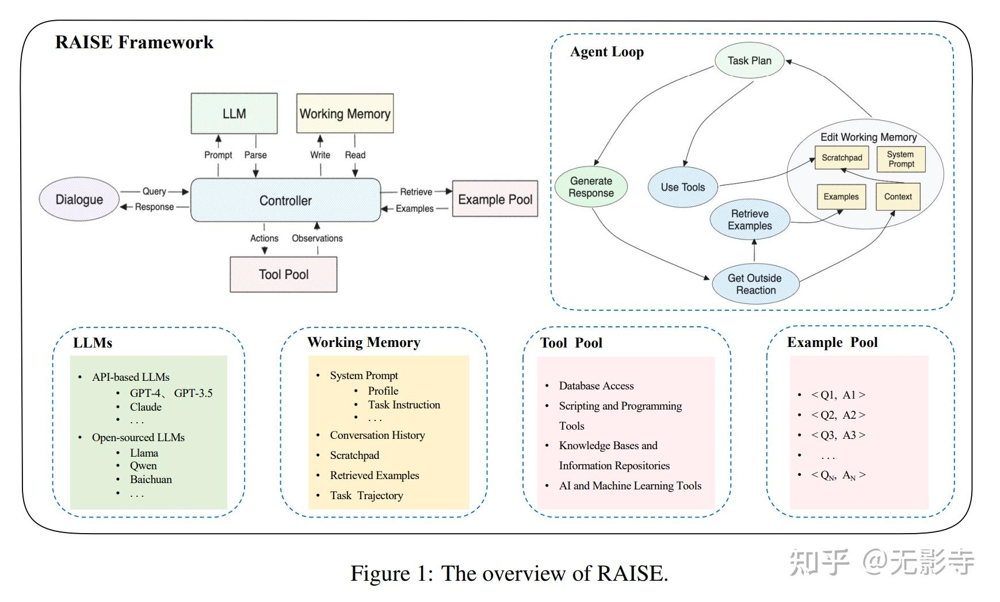

https://zhuanlan.zhihu.com/p/642475769
https://zhuanlan.zhihu.com/p/642703708
https://www.jiqizhixin.com/articles/2023-09-11-8
https://github.com/modelscope/modelscope-agent/blob/master/README_CN.md

Agent 需要多个工具的规划、调度、执行和回复

开裸机 开实例 关裸机 关实例
机器类型 机器样式

https://zhuanlan.zhihu.com/p/676729627
https://baoyu.io/translations/ai-paper/2312.10003-rest-meets-react-self-improvement-for-multi-step-reasoning-llm-agent

https://zhuanlan.zhihu.com/p/671355141
总体上，MetaGPT侧重的是角色扮演，AutoGen侧重的是conversation和 python programming，AutoAgents侧重的是协作，
XAgent强调的是外循环和内循环完成复杂任务的形式。 后面各大厂家纷纷发布了自己的Agent项目。
比如AppAgent，KwaiAgents，Pangu-Agent，modelscope-agent，ERNIE Bot Agent都各具特色，
还有一些机构发布的Agents，例如清华的AgentVerse，港大的OpenAgents等等，
从侧面说明，Agent这个东西没什么特别高的技术门槛，如果效果不好，直接标数据SFT就行，
产生价值的地方就是在应用上面，比如一些传统业务的降本增效，创新业务落地成爆款应用等等。

本质上，核心还是大模型，所有的能力都是以大模型为基础。
而与大模型交互，是通过Prompt来实现，例如告诉大模型你想要做什么，而对于大模型来说，更精细的指令可以得到更准确的结果。 
所以Chains则是将你想要做的事情拆分为一系列小的子任务，将这些子任务进行串联，从而实现目标。
而Agent，则是将调用Chains解决问题的能力进行了封装和抽象，相当于你有了一个“管家”帮你把任务进行拆分和执行。
同时，就像人类社会，一个角色的能力通常是聚焦于某一个领域的，因此需要多个“管家”来分别处理不同的事务。

本研究提出了RAISE，这是一种先进的架构，可增强GPT-4等大语言模型在会话agent中的应用。在ReAct框架的基础上，RAISE集成了双组件记忆系统，
改善了对话上下文的保留(retention)和连续性(continuity)。还在RAISE中提出了一种微调方法，这增强了agent的可控性和效率，
尤其是在房地产销售领域，尽管也适用于其他领域。然而，该研究存在局限性，包括潜在的幻觉问题以及处理复杂逻辑问题的挑战，
需要进一步的研究。尽管存在这些局限性，但RAISE在可适应、意识上下文的会话agent方面呈现出有前途的进步，为人工智能未来发展奠定了基础。
!
RAISE代表了对现有ReAct框架的优化增强，专为增强会话agent的能力而设计。本文详细探讨了RAISE，重点介绍了其独特组件及其在会话agent开发中的优势。

RAISE的基石是其采用了双组件记忆系统，类似于人脑的短期和长期记忆功能。Scratchpad组件充当瞬时存储，捕获并处理最近交互的关键信息和结论，类似于短期记忆。
与此同时，检索模块作为agent的长期记忆运行，汲取并合并相关的例子到当前对话上下文中。这种增强的记忆机制可以灵活地增强会话AI的能力，
并为人类提供了一个方便的接口来自定义和控制会话AI系统的行为。

此外，RAISE架构建立在一个全面的agent构建场景之上，强调从零开始创建会话agent，以确保其在真实世界交互中的真实性和相关性。
论文阐明了RAISE方法论，包括一系列精心编排的阶段。这些包括对话选择、场景提取、CoT(思维链条)完成以及场景增强，所有这些都引向关键的LLM训练阶段。
这种结构化的方法对于开发不仅在语言处理方面，而且在上下文意识和适应能力方面也表现优异的agent至关重要，满足各种会话动态的需要。

仅行动（Act-Only）：通过从ReAct中删除“思考”过程形成该架构，允许通过编码直接生成。
ReAct+Scratchpad：在ReAct的基础上构建，初始的Scratchpad分布包括20%的空白，30%的部分信息，和50%的完全信息内容。
当与不同的输出要求结合时，ReAct数据作为重新生成GPT-4中的CoT过程的提示。
ReAct+Examples：类似于ReAct+Scratchpad，示例的分布为20%的空白，30%的部分信息，和50%的完全信息。
与各种输出要求结合时，ReAct数据被重新构造成驱动GPT-4 CoT再生的提示。
RAISE：该模型整合了ReAct+Scratchpad和ReAct+Examples的各个方面。同样使用GPT-4重新生成CoT过程。
这种结构化方法使得能够对RAISE框架中的每个架构元素进行彻底评估，清楚地展示了每个组件引入的增量效益
