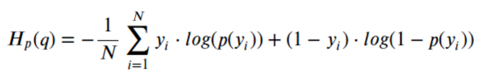
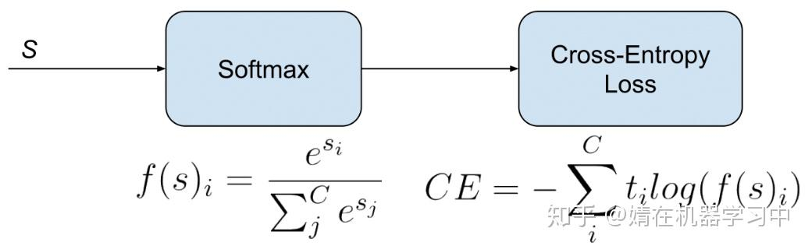

1 bert loss计算
Bert中求loss就是求MLM的loss，通过交叉熵求解预测的损失，即为Bert的loss；

binary_crossentropy

categorical_crossentropy

跟categorical_crossentropy的区别是其标签不是one-hot，而是integer。
比如在categorical_crossentropy是[1,0,0]，在sparse_categorical_crossentropy中是3.

bert模型有一个输入是features["masked_lm_ids"]，有一个函数get_masked_lm_output就是用来获取[mask]位置的输出以供计算loss的，
没有mask的位置是不需要参与计算loss的

2 adam 为什么要这么设计

计算高效，方便实现，内存使用也很少。
更新步长和梯度大小无关，只和alpha、beta_1、beta_2有关系。并且由它们决定步长的理论上限。
对目标函数没有平稳要求，即loss function可以随着时间变化
能较好的处理噪音样本，并且天然具有退火效果
能较好处理稀疏梯度，即梯度在很多step处都是0的情况

m/sqrt(v)可以看做是对梯度“信噪比”（SNR）的估计，其中m是信号量，而v是噪音量。当噪音大时，步长小；噪音小时，步长大。这正是我们需要的特性，
从而使得Adam能够较好的处理噪音样本，另外，当我们接近最优点时，噪音通常会变得很大，或者说真正的信号变得很微弱，信噪比通常会接近0，
这样步长就会变得较小，从而天然起到退火效果

3 bert crf 为什么加crf

bert给的是base model，加crf去约束label之间的关系，性能上肯定是有提升的。

CRF不是必备，viterbi才是必备。只要解码的时候禁止B->O, S->I之类的非法transition即可。
但对POS tagging之类没有硬性forbidden transition的约束，也不需要viterbi。

bert为什么加不加crf都行，加crf好处在哪？
加crf：相当于是显式地去捕捉标签之间的依赖关系。
但是为什么很多人说bert和bert+crf效果差不多，我觉得bert能够表达的语义空间足够丰富，去捕捉到标签之间的依赖关系。
也有人说bert+crf还是会好一些，我认为可能是数据集相关特性的关系，或者调参等等原因。

1.BERT+BiLSTM+CRF>BiLSTM+CRF
多了一层BERT初始化word embedding，比随机初始化肯定要好，这个就不多解释了。

2.BERT+BiLSTM+CRF>BERT+CRF
首先BERT使用的是transformer，而transformer是基于self-attention的，也就是在计算的过程当中是弱化了位置信息的
（仅靠position embedding来告诉模型输入token的位置信息），而在序列标注任务当中位置信息是很有必要的，甚至方向信息也很有必要
（我记得复旦大学去年的一篇NER论文TENER当中有提到过这一点，感兴趣可以直接知乎搜TENER），所以我们需要用LSTM习得观测序列上的依赖关系，
最后再用CRF习得状态序列的关系并得到答案，如果直接用CRF的话，模型在观测序列上学习力就会下降，从而导致效果不好。（纯属个人见解）
