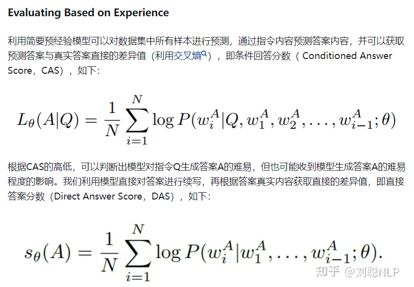
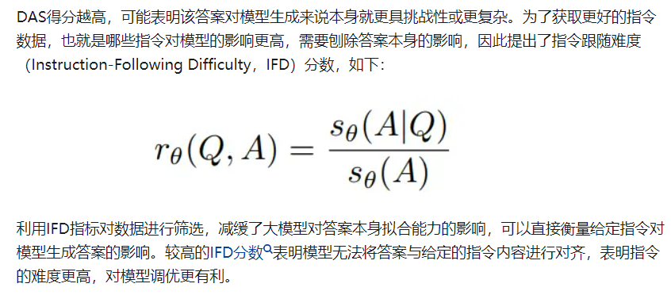
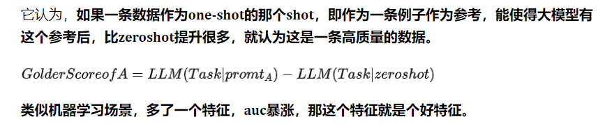

https://zhuanlan.zhihu.com/p/675928711
https://zhuanlan.zhihu.com/p/671183709

利用IFD指标自动筛选樱桃数据，再利用樱桃数据进行模型指令微调，获取更好地微调模型，
主要涉及三个步骤：
Learning from Brief Experience：利用少量进行进行模型初学；
Evaluating Based on Experience：利用初学模型计算原始数据中所有IFD指标;
Retraining from Self-Guided Experience：利用樱桃数据进行模型重训练。

Learning from Brief Experience利用少量数据进行模型初学习的原因如下：
一些模型为Base模型，只能进行续写，并没有指令遵循的能力；
LIMA已经证明高质量数据可以让模型具有指令遵循能力；
如果采用大量数据进行学习，时间成本和资源成本较高。
而在少量数据的选择上，数量选择1k条样本，为了保证数据的多样性，采用K-Means方法对指令进行聚类，共聚出100个簇，每个簇里选择10个样本。
并且仅在初始模型上训练1个epoch获取简要预经验模型（Brief Pre-Experience Model）。

Retraining from Self-Guided Experience
利用IFD指标，对原数据集进行排序，选择分数靠前的数据作为樱桃数据，对原始模型进行指令微调，获取樱桃模型。

结果比较惊人，在Alpaca数据中，选出top 1%的数据，就能取得和使用全部Alpaca类似的效果！
