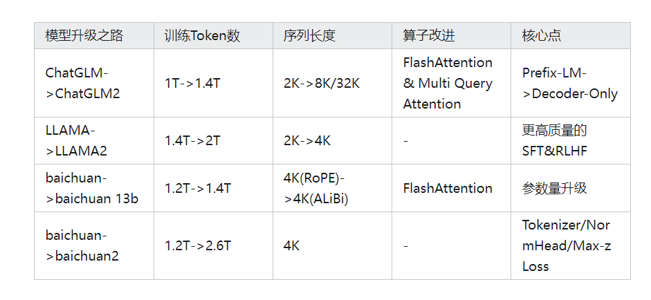

https://zhuanlan.zhihu.com/p/651747035

https://zhuanlan.zhihu.com/p/644815089

https://zhuanlan.zhihu.com/p/659875511  最多400万token上下文

Mistral 7B
https://zhuanlan.zhihu.com/p/668545121
SWA 的设计还能以更低的计算成本更有效地处理更长的序列，从而缓解 LLM 的一个常见限制
滑动窗口注意力SWA 利用transformer的堆叠层来关注窗口大小 W 以外的信息。
位于第 k 层第 i 个位置的隐藏状态 hi 会关注上一层中所有位置介于 i - W 和 i 之间的隐藏状态。如图 1 所示， 
 可以从输入层访问距离为 W × k 的token。在最后一层，使用 W=4096 的窗口大小，我们的理论注意力跨度约为 131K token。
实际上，在序列长度为 16K 和 W = 4096 的情况下，对 FlashAttention [11] 和 xFormers [18] 所做的改动比普通注意力基线的速度提高了 2 倍。

滚动缓冲缓存。固定的注意力跨度意味着我们可以使用滚动缓冲缓存来限制缓存的大小。缓存的大小固定为 W，时间步 i 的键和值存储在缓存的位置 i mod W 中。
因此，当位置 i 大于 W 时，缓存中过去的值就会被覆盖，缓存的大小就会停止增加。图 2 以 W=3 为例进行了说明 在序列长度为 32k token的情况下，
缓存内存使用量减少了 8 倍，而模型质量却没有受到影响。

预填充和分块。在生成序列时，我们需要逐个预测token，因为每个token都以前面的token为条件。
不过，提示语是事先已知的，我们可以用提示语预先填充 (k, v) 缓存。如果提示语非常大，我们可以把它分成小块，
并用每块预先填充缓存。为此，我们可以选择窗口大小作为分块大小。
因此，我们需要计算每个分块在缓存和分块上的注意力。图 3 显示了缓存和数据块上的注意力mask是如何工作的。