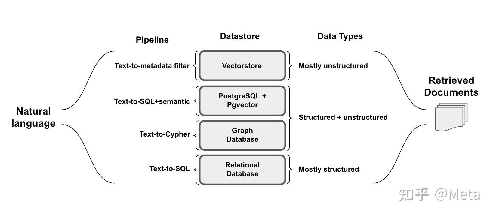

BM25
https://zhuanlan.zhihu.com/p/420048609
Vector DB
Hybrid (rrf and cc)
https://zhuanlan.zhihu.com/p/664143375
HyDE
https://zhuanlan.zhihu.com/p/654503734

ColBERT
https://zhuanlan.zhihu.com/p/676379481
https://zhuanlan.zhihu.com/p/660596952

https://zhuanlan.zhihu.com/p/633671394

1）本文还是关于最近很热门的向量召回。ColBERT v2是目前dense retrieval的SOTA之一，
主要体现在in-domain很高的MRR@10(头部排序能力)和Recall@1k(腰尾部召回能力), 以及out-domain非常强的泛化能力。
2）ColBERT v1提出了”late interaction”的概念。和query-doc全交互型BERT相比，late interaction指query和doc先做term粒度的encoding，
然后在查询阶段做term粒度的交互，这样的好处是doc侧的计算可以全部在离线进行，也是目前dual-encoder的通用做法。
3）但是和目前比较流行的dual-encoder相比(query和doc分别用单一向量表示), ColBERT v1会对每个term生成一个向量，
然后用MaxSim来计算得分(query每个term的向量，先去和doc所有向量计算相似度得分取max，然后所有term得分再求和)。
4）这种multi-vector的向量召回方式，论文中提到两点好处：A. 相比整个query/doc一个向量，term粒度的向量允许更细粒度的表征；
B. Out-of-domain的性能比较好。直观上很好理解，对于长尾query或者doc，sentence粒度的表征因为稀疏可能学的不是很好，
但是term粒度的表征还是学的比较充分，所以泛化能力会更强。
5）ColBERT v2在v1的基础上，增加了最近几年向量召回常有的涨点技巧（蒸馏和难负例），同时用类似PQ的量化方式压缩Multi-vector建索引时多余消耗的内存。

作者首先采用的第一个改进技术是Distillation，即希望模型输出的分数和一个小型的LM（MiniLM）Cross-Encoder输出的分数一致。同时也采用in-batch negative方法。

采用的第二个改进技术是表示压缩，即作者对这些token的向量表示进行聚类。如上图所示，聚类中大多是一些相似的token，
作者对600M token聚类得到约260 k的聚类中心，然后对每个向量表示为：
向量表示 = 聚类中心向量表示 + 残差向量表示
的形式，其中每个维度的残差向量表示用1到2个bit表示。
这样可以大大节省空间占用。

 突破双塔: 生成式交互的向量化召回
https://zhuanlan.zhihu.com/p/670599501
这篇文章主要是在passage retrieval上做的工作，核心关注是如何提高双塔相关性匹配的效果。具体而言，就是在doc侧设计一个轻量的query生成模块，
 利用doc侧特征作为输入，去fake一个query侧表征，去重构出query侧的输入特征。这样一来，doc侧也能用生成式的方式去引入另一侧的特征，
 并从底层开始实现特征交叉。当然这里需要注意的是，也仅仅是在正样本上执行重构loss。

对称语义检索与非对称语义检索

阈值很低时候启动
非对称语义检索
就直接把问题+答案拼在一起，做个二分类嘛。模型同时有了问题+答案这样一对的上下文信息，当然比直接分别将问题+答案映射到相同的向量空间、再计算相似度准的多了。
但是这种计算向量相似度的模式会慢。假设有 m 个问题和 n 个答案，向量检索（图中的 bi-encoder 环节）只需要跑 m+n 次 bert 模型就够了，但是 cross-encoder 需要将所有问题和答案分别组合起来，跑 m*n 次 bert 模型。

https://zhuanlan.zhihu.com/p/678189285
查询构造方式	数据源	参考
Text-to-metadata-filter	向量库	            Docs
Text-to-SQL	            关系型数据库	        Docs, blog, blog
Text-to-SQL+ Semantic	支持SQL的PGVecvtor	Cookbook
Text-to-Cypher	        图数据库	            Blog, Blog, Docs

Text-to-metadata-filter
数据源定义：self-query-retriever的核心是相关metadata文件的明确规范（例如，在歌曲检索的背景下，相关的metadata可能是歌手、长度和流派）。
用户查询解释：给定一个自然语言问题，self-query-retriever将隔离查询（用于语义检索）和metadata过滤的过滤器。
例如，针对以下问题的查询“songs by Taylor Swift or Katy Perry about teenage romance under 3 minutes long in the dance pop genre”
会被分解为过滤器和语义查询。
逻辑条件提取：过滤器本身是由向量库定义的比较器和运算符（如“eq”表示“等于”，“lt” 表示“小于”条件）构成。
生成结构化请求：最后，self-query-retriever将语义搜索词（查询）从逻辑条件（过滤器）中分离出来，简化文档的检索过程。

Text-to-SQL
SQL/关系数据库是大量结构化数据的重要来源。
幻觉问题：LLM 容易对虚构的表或字段产生“幻觉”，从而创建无效的查询。必须要确保LLM在数据库真实字段的基础上进行有效的SQL生成。
用户错误：NL2SQL的方法应该对用户拼写错误或用户输入中的其他不规则情况具有鲁棒性，这些错误可能导致无效查询。
以下的一些技巧可以缓解这些问题的发生：
数据库描述：为了使SQL查询真实，必须为LLM提供数据库的准确描述。一个常见的NL2SQL-prompt大致如下：为LLM提供每个表的CREATE TABLE描述，
其中包括列名、列类型等，然后紧跟几个数据样例。
Few-Shot：在Prompt提供几条匹配的“用户问题-SQL”对示例可以提高查询生成准确性。
错误处理：当遇到错误时，可以retry几次。我们可以使用SQL agents工具来处理错误。
查找专有名词中的拼写错误：当查询像名字这样的专有名词时，用户可能会无意中拼写错误。我们可以允许代理在向量库中搜索专有名词，
向量库中包含SQL数据库中相关专有名词的正确拼写。

Text-To-SQL+semantic
混合类型（结构化和非结构化）的数据存储同样越来越常见。
混合检索方式的推广需要有向关系数据库添加向量支持的能力。例如，PostgreSQL的开源pgvector扩展将SQL的表达能力与语义搜索提供的对语义的细微理解相结合。
SELECT * FROM tracks ORDER BY "name_embedding" <-> {sadness_embedding}
这解锁了两个重要的新功能：
我们可以进行在向量库中无法实现的语义搜索。
我们可以利用语义运算符的知识来增强text-to-SQL的能力。例如，它能够将文本到语义搜索（例如，查找标题传达特定情感的歌曲）和SQL查询（例如，按流派过滤）相结合。
根据专辑歌曲的例子，通过这种方法，我们可以找到包含最多符合某种情绪的歌曲的专辑

Text-to-Cypher
图数据库经常使用一种名为Cypher的特定查询语言，该语言旨在提供一种匹配模式和关系的可视化方式。
