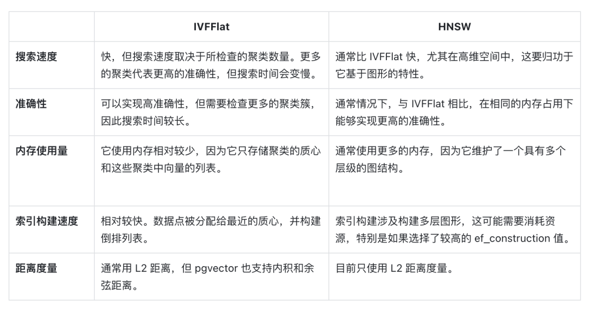

embedding:
1 - openai -- tiktoken  
encoding = tiktoken.encoding_for_model('gpt-3.5-turbo')
而OpenAI的text-embedding-ada-002最高支持8K的序列长度
2 - multilingual-e5 
https://zhuanlan.zhihu.com/p/642237510
multilingual-e5-large
特征维度：1024
数据量大的时候，embedding比较耗时
支持94种语言
multilingual-e5-base, 768

3 - contriever facebook/contriever
https://zhuanlan.zhihu.com/p/646227892
4 - bge-large-zh --openpyxl sheet --csv --CSVLoader 读取
BGE一个问题是它的输入序列只有512
bge-large-zh	1.3GB	/	1024
bge-base-zh	409MB	/	768	
bge-small-zh	95.8MB	/	512

https://zhuanlan.zhihu.com/p/669596130

https://zhuanlan.zhihu.com/p/648839329

BGE的技术亮点：
高效预训练和大规模文本微调；
在两个大规模语料集上采用了RetroMAE预训练算法，进一步增强了模型的语义表征能力；
通过负采样和难负样例挖掘，增强了语义向量的判别力；
借鉴Instruction Tuning的策略，增强了在多任务场景下的通用能力。

RetroMAE预训练
主要思想是encoder用小一点的mask rate得到sentence embedding，然后decoder用大一点的mask rate结合encoder得到的sentence embedding进行重构
此外，为了使得每个token使用的context信息不同，RetroMAE还使用了增强解码的方法

微调
主要通过对比学习和Instruction Tuning的思想
对比学习是一种训练模型的方法，通过比较正例和反例来学习数据的表示。
输入数据的格式：模型接受三元组格式的数据作为输入，包括一个查询（query），一个正例（positive），和一个反例（negative）。
in-batch negatives 策略：除了上述三元组中的反例外，他们还采用了“in-batch negatives”策略，意思是在同一个批次的数据中，使用其他数据作为额外的反例。
cross-device negatives sharing method：这是一种在不同的GPU之间共享反例的方法，目的是大大增加反例的数量。
训练硬件和参数：使用了48个A100(40G)的GPU进行训练。批次大小为32,768，因此每个查询在批次中有65,535个反例。使用了AdamW优化器，学习率为1e-5。对比损失的温度为0.01。
在训练中为检索任务的查询添加了instruction。 对于英语，指令是Represent this sentence for searching relevant passages: ;
对于中文，指令是为这个句子生成表示以用于检索相关文章：. 在评测中，针对段落检索任务的任务需要在查询中添加指令，但不需要为段落文档添加指令。

如果有自己的数据集，建议按照官方说明，微调bge。难负例的挖掘十分重要，数量控制在2-8个为宜；batch size 尽可能的越大越好，
但实测下来40G显存的A100，batchsize最大能开到32。有实力的，直接上多显卡的分布式计算。微调的epoch不建议过大，1-2个epoch为宜。

5 - m3e -- 有格式的PDF和html 提取页面布局信息和表格信息 只支持英文
https://zhuanlan.zhihu.com/p/658112595
https://zhuanlan.zhihu.com/p/652295456

王宇昕指出，在 M3E 项目开始之初，团队就发现了这一趋势，因此 M3E 研究团队对此进行了广泛的调研和实践，最终总结出大规模句对监督数据集 + 指令数据集 + 对比学习的解决方案。
M3E 的研究经历了六个阶段。训练数据准备阶段，M3E 研究团队在 HuggingFace、千言、和鲸等社区收集 30个，包含中文百科、金融、医疗、法律、新闻、学术等多个领域的数据集，
共计 2200 万句对样本。这些数据集包括问答、摘要、NLI、NL2SQL 等多种类型的任务。M3E 研究团队将这一数据集进行了收集和整理，并标注了元信息。
训练代码准备阶段，M3E 研究团队提出了 uniem 文本嵌入模型训练框架，对其中重要的组成部分进行了抽象和接口设计，目前 uniem 支持三种样本结构，
包括句子对、句子三元组和评分句对，支持三类对比学习损失函数、CoSentLoss、SoftmaxContrastLoss 以及 SigmoidContrastLoss。
“通过对这些组件的组合，我们可以轻松的复现各种对比学习算法和文本嵌入论文，如 SimCSE, Instructor，SGPT 等。”王宇昕说。
模型训练阶段，M3E 在项目前期就使用了规模较小的模型进行超参数实验和调优，因此，在实际训练的超参数调优上并没有消耗多少精力。为了保证批次内负采样的效果，
M3E 的模型均使用 A100 80G 机器最大化单节点的 batch size。M3E-base 模型在 A100 上进行了 2200万 样本的一轮次训练，共计 34 个小时。
评估数据准备阶段，为了评估中文文本嵌入模型的效果， M3E 研究团队效仿和使用 HuggingFace MTEB 的评测集构造的形式，收集了 7 种不同的数据集，
包括电商文本、股票文本、长文本以及社区问答等类型。
评估代码准备阶段，M3E 使用 MTEB BenchMark 中的数据格式对收集到的评测数据进行整理和代码设置，形成了 MTEB-zh 评测脚本，通过和 MTEB 相同的方式，
就可以对中文嵌入模型进行一键评估。M3E 团队在第一期对 text-embedding-ada-002、text2vec、M3E-small 和 M3E-base 进行了详细的评估和分析。
模型发布阶段，M3E 团队整理了训练数据集，训练代码，模型权重，评估数据集，评估代码，并一一进行开源和文档撰写。

M3E 使用 in-batch 负采样的对比学习的方式在句对数据集进行训练，为了保证 in-batch 负采样的效果，使用 A100 80G 来最大化 batch-size，
并在共计 2200W+ 的句对数据集上训练了 1 epoch。
使用了指令数据集，M3E 使用了 300W + 的指令微调数据集，这使得 M3E 对文本编码的时候可以遵从指令，这部分的工作主要被启发于 instructor-embedding。
基础模型，M3E 使用 hfl 实验室的 Roberta 系列模型进行训练，目前提供 small 和 base 两个版本，大家则需选用。
还没仔细看源码，估计和BGE差不多，因为都采取了 in-batch 负采样的训练方法。

其实可以看出语义相似的损失函数——主要思路是构建句子之间的相似度矩阵,然后通过比较正例和负例的相似度,
采用交叉熵、log-sum-exp等方式计算loss,优化模型的句子表示,使得正例相似度更高。

字符分割
BPE
BPE获得Subword的步骤如下：
准备足够大的训练语料，并确定期望的Subword词表大小；
将单词拆分为成最小单元。比如英文中26个字母加上各种符号，这些作为初始词表；
在语料上统计单词内相邻单元对的频数，选取频数最高的单元对合并成新的Subword单元；
重复第3步直到达到第1步设定的Subword词表大小或下一个最高频数为1.
BBPE
具体的，BBPE考虑将一段文本的UTF-8编码(UTF-8保证任何语言都可以通用)中的一个字节256位不同的编码作为词表的初始化基础Subword。
相比ASCII只能覆盖英文中字符，UTF-8编码创建的本身就是为了通用的将世界上不同的语言字符尽可能全部用一套编码进行编号，
同时相比UTF-32对于每个字符都采用4位字节（byte）过于冗长。改进的UTF-8编码是一个变长的编码，有1～4个范围的字节(bytes)长度。
对于不同语言中字符采用不同长度的字节编码，例如英文字符基本都是1个字节（byte），中文汉字通常需要2～3个字节
WordPiece、Unigram和SentencePiece
与BPE算法类似，WordPiece算法也是每次从词表中选出两个子词合并成新的子词。与BPE的最大区别在于，
如何选择两个子词进行合并：BPE选择频数最高的相邻子词合并，而WordPiece选择能够提升语言模型概率最大的相邻子词加入词表。

与WordPiece一样，Unigram Language Model(ULM)同样使用语言模型来挑选子词。不同之处在于，BPE和WordPiece算法的词表大小都是从小到大变化，
属于增量法。而Unigram Language Model则是减量法,即先初始化一个大词表，根据评估准则不断丢弃词表，
直到满足限定条件。ULM算法考虑了句子的不同分词可能，因而能够输出带概率的多个子词分段。

SentencePiece，它是谷歌推出的子词开源工具包，其中集成了BPE、ULM子词算法

https://zhuanlan.zhihu.com/p/198964217
https://zhuanlan.zhihu.com/p/649030161

vectorstore：
1 - chroma  一个开源嵌入式数据库
2 - faiss  Facebook AI相似性搜索服务
3 - milvus  用于存储、索引和管理由深度神经网络和其他机器学习（ML）模型产生的大量嵌入向量的数据库
4 - pgEmbedding  MarkdownHeaderTextSplitter
5 - pgVector  一个用于Postgres的开源向量相似性搜索服务
6 - pinecone  一个具有广泛功能的向量数据库
7 - ElasticSearch	ElasticSearch

https://zhuanlan.zhihu.com/p/628148081
数据库名称	是否开源	社区影响力	编程语言	核心特性	适用场景
Pinecone	否		未知	向量存储与检索、全托管	Saas类业务场景
weaviate	是	5.3k star	Go	同时支持向量与对象的存储、支持向量检索与结构化过滤、具备主流模式成熟的使用案例。高速、灵活，不仅仅具备向量检索，还会支持推荐、总结等能力	
qdrant	是	6.3k star	Rust	向量存储与检索、云原生、分布式、支持过滤、丰富的数据类型、WAL日志写入	
milvus	是	17.7k star	Go	极高的检索性能: 万亿矢量数据集的毫秒级搜索非结构化数据的极简管理丰富的API跨平台实时搜索和分析可靠：具有很高的容灾与故障转移能力高度可拓展与弹性支持混合检索统一的Lambda架构社区支持、行业认可
https://www.milvus-io.com/index
Chroma	是	4.1k star	python	轻量、内存级
https://zhuanlan.zhihu.com/p/644056626

在 pg_embedding 和 pgvector 之间的选择取决于你的具体用例和需求：

内存限制 (pgvector)：如果你在严格的内存限制下工作，可以选择 IVFFlat，因为它通常比 HNSW 消耗内存更少，代价是搜索速度和准确性。
搜索速度 (pg_embedding)：如果你主要关注快速检索最近邻的速度，特别是在高维空间中，由于其基于图形的方法，pg_embedding 很可能是更好的选择。
准确性和召回 (pg_embedding)：如果对你的应用程序来说实现高准确性和召回至关重要，则 pg_embedding 可能是更好的选择。与 IVFFlat 相比，HNSW 基于图形的方法通常产生更高水平的召回。
距离度量 (pgvector)：无论是 pgvector 还是 pg_embedding 都支持 L2 距离度量。此外，pgvector 还支持内积和余弦距离。
在 pg_embedding 和 pgvector 之间的选择取决于你的具体用例和需求：

