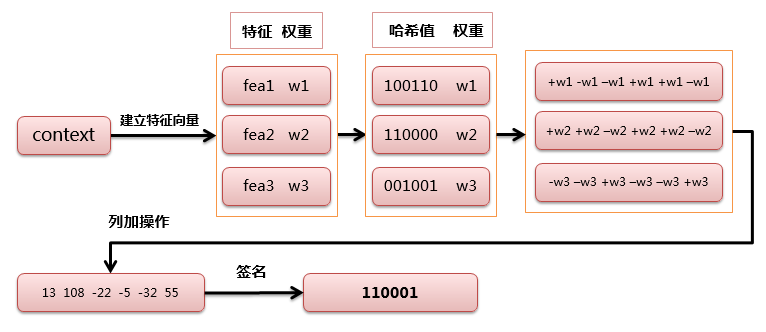

2.异常清洗
完成上一步的操作后，在功能列左侧选择异常清洗配置开关，效果展示区展示内置数据在指定清洗操作下的效果预览。

可选异常清洗配置如下所示：
1）移除不可见字符：移除ASCII中的一些不可见字符, 如0-32 和127-160这两个范围。
2）规范化空格：将不同的unicode空格比如  u2008，转成正常的空格。
3）去除乱码：去除乱码和无意义的unicode。
4）繁体转简体：将文档中的繁体字转换成简体。
5）去除网页标识符：移除文档中的html标签，如<html>,<dev>,
等。
6）去除表情符：去除表情符如image.png

3.过滤
完成上一步的操作后，在功能列左侧选择过滤配置开关，效果展示区展示内置数据在指定清洗操作下的效果预览。

可选过滤配置如下所示，每项过滤配置都可在打开后进行范围内取值：
1）检查文档的词数目：词数目不在指定范围会被过滤掉，如中文，取值范围[1,1000000]（正整数）。
2）检查文档的字重复率：如果字重复率太高，意味着文档中重复的字太多，文档会被过滤掉，取值范围[0,1]。
3）检查文档的词重复率：如果词重复率太高，意味着文档中重复的词太多，文档会被过滤掉，取值范围[0,1]。
4）检查文档的特殊字符率：如果特殊字符率太高，意味着文档中特殊字符太多，文档会被过滤掉，取值范围[0,1]。
5）检查文档的色情暴力词率：如果色情暴力词率太高，文档会被过滤掉，取值范围[0,1]。
6）检查文档的语言概率：如果语言概率太低，文档会被过滤掉，取值范围[0,1]。
7）检查文档的困惑度：如果困惑度太高，文档会被过滤掉，取值范围[0,5000]。

4.去重
完成上一步的操作后，在功能列左侧选择去重配置开关，效果展示区展示内置数据在指定清洗操作下的效果预览。

可选去重配置为simhash-operator，根据海明距离计算文档相似度, 相似度<=海明距离，认为两个文档相似。（范围：4-6）。

去重 
余弦相识度
simhash

以64位的签名来说，把它以每16位划分块，如果两个签名海明距离小于等于3，则至少有一个16位块完全相同
jaccard
编辑距离

5.去隐私
完成上一步的操作后，在功能列左侧选择去隐私配置开关，效果展示区展示内置数据在指定清洗操作下的效果预览。

可选去隐私配置如下所示：
1）去除数字：去除数字和字母数字标识符，如电话号码、信用卡号、十六进制散列等，同时跳过年份和简单数字的实例。
2）去除Email：去除Email地址。
3）去除IP地址：去除IPv4 或者 IPv6 地址。
