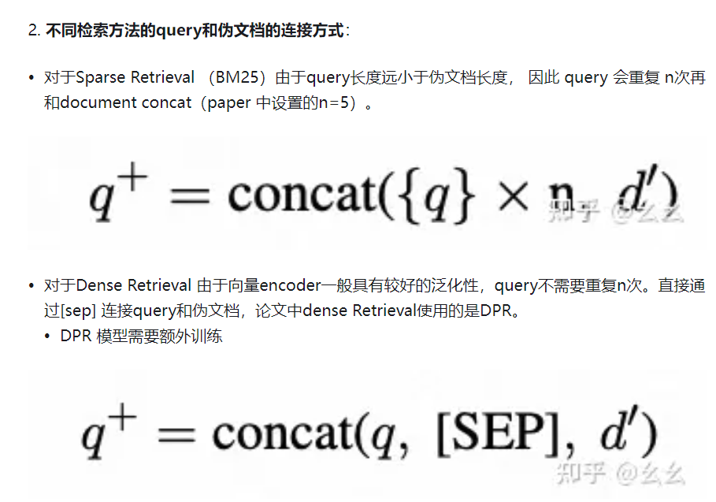

https://zhuanlan.zhihu.com/p/664856716
https://zhuanlan.zhihu.com/p/670594833
https://zhuanlan.zhihu.com/p/666414155
https://zhuanlan.zhihu.com/p/672982980
https://zhuanlan.zhihu.com/p/663821101

利用few-shot的prompt引导LLM生成包含当前待检索query答案的伪文档(pseudo-documents)。拼接query 和 伪文档，共同用作召回。
实验结果证明，在不经过fine-tuning的前提下，利用Query2doc生成的伪文档可以为传统BM25检索方式提升3%-15%的表现在ad-hoc IR数据集上。
主要创新在于利用大模型生成的答案伪文档为待检索的query增加了额外信息，从而提升召回结果的相关性。

query-query
query-doc
query-answer
query-abstract
word-passage
sentiment

对搜索数据进行数据增强就是获取更多的“query-doc”对。一种方法是根据query生成假doc，而另一种是根据doc生成假query。
还可以利用LLM获取query与doc的假labe

传统的query结构化理解是通过分词、NER、query tagging等方式将query转换为结构化信息

